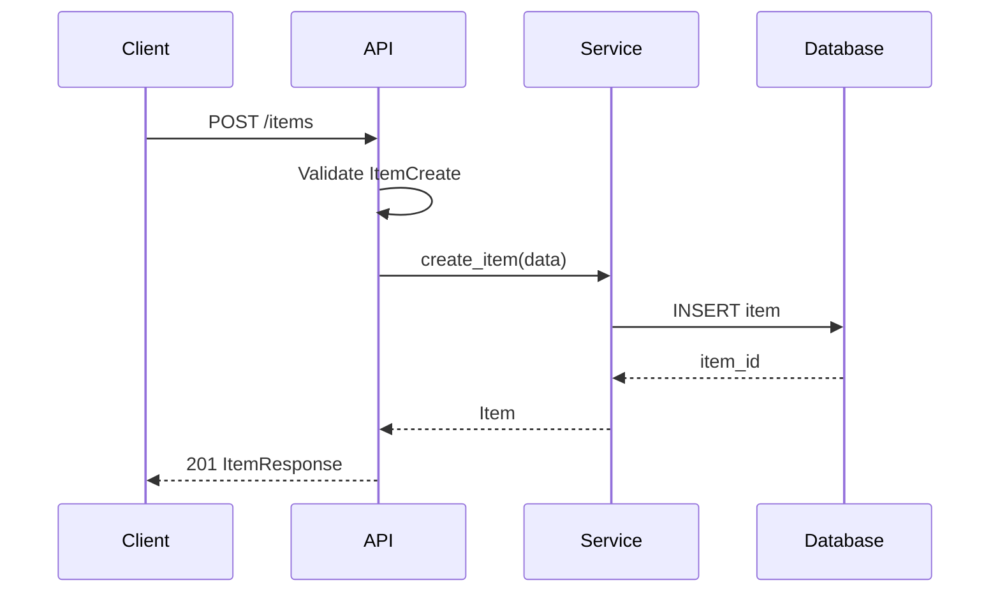

# Cursor Rules Review & Recommendations
## For AI Engineering Web/API Development Course

*Last Verified: 2025-12-08 via web_search MCP tool*

---

## Executive Summary

Your existing cursor rules provide a decent foundation but are **too generic and brief** to be effective for an AI Engineering course focused on Web/API development. The rules lack:

1. **Actionable specificity** - They describe what to do but not how
2. **API-first/Schema-first workflow guidance** - Critical for modern development
3. **Technology stack context** - No mention of your recommended docs (FastAPI, Pydantic, AI-SDK, etc.)
4. **Scaffolding-before-coding philosophy** - The OpenAPI-first approach you want
5. **AI-specific patterns** - Nothing about building AI applications

Below I provide detailed feedback on each file, followed by **recommended new rules** tailored to your course.

---

## Review: `general.mdc`

### Current Content Analysis

```markdown
---
alwaysApply: true
---
# Cursor Rules

## 1. Code Structure & Organization
- Enforce one clear entry point (main.tsx, api.py, etc.)
- Require descriptive folder names (/components, /hooks, /services)
- Limit file size (e.g., warn if file >300 lines)
- Require each component to live in its own file
- Enforce consistent imports (absolute paths, no deep relative ../../../)

## 🎨 2. Naming Conventions
- **Variables:** camelCase
- **Components & Classes:** PascalCase
- **Constants:** UPPER_SNAKE_CASE
```

### Issues Identified

| Problem | Impact | Recommendation |
|---------|--------|----------------|
| **Too short** (~20 lines) | AI lacks sufficient context to make good decisions | Expand to 100-200 lines with detailed examples |
| **No role definition** | AI doesn't know what expertise to apply | Add explicit role: "You are a senior Python/FastAPI developer..." |
| **No technology stack** | AI may suggest wrong libraries/patterns | Specify: FastAPI, Pydantic, uv, AI-SDK, etc. |
| **No Python conventions** | Rules appear React/JS focused (camelCase vars) | Python uses `snake_case` for variables/functions |
| **No examples** | AI can't learn from concrete patterns | Add code snippets showing correct patterns |
| **No "don'ts"** | Missing negative constraints | Add explicit anti-patterns to avoid |
| **No workflow guidance** | Doesn't teach design-before-code approach | Add scaffolding/planning requirements |
| **Incomplete** | Only 2 of presumably more sections | Finish all planned sections |

### Specific Issues

1. **Python Naming Mismatch**: Your rules say `camelCase` for variables, but Python convention (PEP 8) uses `snake_case`. This will confuse AI and students.

2. **Missing Entry Point for FastAPI**: `main.tsx` suggests React; for FastAPI courses, it should be `main.py` or `app/main.py`.

3. **No Pydantic Guidance**: Your course emphasizes Pydantic, but rules don't mention schema-first design.

---

## Review: `gitflow.mdc`

### Current Content Analysis

The gitflow rules are comprehensive for basic GitFlow commands but have issues:

### Issues Identified

| Problem | Impact | Recommendation |
|---------|--------|----------------|
| **`alwaysApply: true`** | Git commands shown every request, wasting tokens | Change to `alwaysApply: false` or use globs |
| **Documentation, not rules** | This is a reference guide, not AI instructions | Reframe as behavioral instructions |
| **No AI behavior guidance** | Doesn't tell AI what to do when coding | Add "when making changes, ensure commits follow..." |
| **Missing feature branches** | Most common GitFlow pattern omitted | Add feature branch workflow |
| **No conventional commits** | Modern best practice missing | Add commit message format rules |

### Recommended Change

This file should be:
1. **Split** into a reference doc (`.cursor/docs/gitflow-reference.md`) 
2. **Converted** to actual AI behavioral rules in a separate `.mdc` file

---

## Recommended New Cursor Rules Structure

Based on your course focus and documentation sources, here's a recommended structure:

```
.cursor/
├── rules/
│   ├── global.mdc              # Always applied - core principles
│   ├── python-fastapi.mdc      # Auto-attach for *.py files
│   ├── pydantic-schemas.mdc    # Schema-first development
│   ├── api-design.mdc          # OpenAPI-first approach
│   ├── ai-patterns.mdc         # AI/LLM integration patterns
│   ├── git-workflow.mdc        # Git behavioral rules (not docs)
│   └── testing.mdc             # Testing requirements
├── docs/
│   └── gitflow-reference.md    # Reference documentation
└── mcp.json                    # MCP server configs
```

---

## Recommended Rule: `global.mdc`

```markdown
---
alwaysApply: true
---
# AI Engineering Course - Global Development Rules

## Role & Context
You are a senior AI Engineer and Solutions Architect specializing in:
- FastAPI for high-performance Python APIs
- Pydantic v2 for data validation and schema design
- Modern Python (3.11+) with type hints
- AI/LLM integration patterns (OpenAI, Anthropic, LangChain)
- Production-ready, scalable architectures

## Core Philosophy: Design Before Code

**CRITICAL**: Before writing any implementation code, always:

1. **Clarify Requirements** - Ask clarifying questions if the request is ambiguous
2. **Design the Schema** - Define Pydantic models FIRST
3. **Plan the API** - Outline endpoints with OpenAPI semantics
4. **Document the Flow** - Use Mermaid diagrams for complex logic
5. **Then Implement** - Write code that matches the design

## Technology Stack

| Layer | Technology | Documentation |
|-------|------------|---------------|
| Runtime | Python 3.11+ | python.org |
| Package Manager | uv | astral.sh/uv |
| Web Framework | FastAPI | fastapi.tiangolo.com |
| Validation | Pydantic v2 | docs.pydantic.dev |
| AI Integration | OpenAI SDK, AI-SDK | platform.openai.com |
| Agents | PydanticAI, OpenAI Agents | ai.pydantic.dev |
| Diagrams | Mermaid | mermaid.js.org |
| Version Control | Git (GitFlow) | - |

## Code Style (Python - PEP 8)

### Naming Conventions
- **Variables & Functions**: `snake_case`
- **Classes & Pydantic Models**: `PascalCase`
- **Constants**: `UPPER_SNAKE_CASE`
- **Private members**: `_single_leading_underscore`
- **Type variables**: `T`, `TRequest`, `TResponse`

### Type Hints - MANDATORY
```python
# ✅ CORRECT - Always use type hints
def get_user(user_id: int) -> User:
    ...

async def create_item(item: ItemCreate) -> ItemResponse:
    ...

# ❌ WRONG - No type hints
def get_user(user_id):
    ...
```

### Import Order
```python
# 1. Standard library
from typing import Annotated
from datetime import datetime

# 2. Third-party packages
from fastapi import FastAPI, Depends, HTTPException
from pydantic import BaseModel, Field

# 3. Local application imports
from app.models import User
from app.services import UserService
```

## Project Structure

```
project/
├── pyproject.toml          # Project config (uv/pip)
├── .env.example            # Environment template
├── README.md               # Project documentation
├── app/
│   ├── __init__.py
│   ├── main.py             # FastAPI app entry point
│   ├── config.py           # Settings with pydantic-settings
│   ├── dependencies.py     # Dependency injection
│   ├── models/             # Pydantic models (schemas)
│   │   ├── __init__.py
│   │   ├── base.py         # Base model classes
│   │   ├── user.py         # User models
│   │   └── requests.py     # Request/Response models
│   ├── routers/            # API route handlers
│   │   ├── __init__.py
│   │   ├── users.py
│   │   └── health.py
│   ├── services/           # Business logic layer
│   │   ├── __init__.py
│   │   └── user_service.py
│   └── utils/              # Utility functions
├── tests/
│   ├── __init__.py
│   ├── conftest.py         # Pytest fixtures
│   └── test_api/
└── scripts/                # CLI scripts
```

## Error Handling

Always use structured error responses:

```python
from fastapi import HTTPException, status

# ✅ CORRECT - Descriptive errors with proper status codes
raise HTTPException(
    status_code=status.HTTP_404_NOT_FOUND,
    detail={"message": "User not found", "user_id": user_id}
)

# ❌ WRONG - Generic errors
raise Exception("Error")
```

## DO NOT

- Never use `print()` for logging - use `logging` module or `structlog`
- Never hardcode secrets - use environment variables via `pydantic-settings`
- Never skip type hints on function signatures
- Never use `Any` type unless absolutely necessary (document why)
- Never write implementation before defining Pydantic schemas
- Never create APIs without considering OpenAPI documentation
- Never commit `.env` files or secrets to git
```

---

## Recommended Rule: `api-design.mdc`

```markdown
---
description: OpenAPI-first API design workflow - invoke when designing new endpoints
globs: ["**/routers/**/*.py", "**/api/**/*.py"]
alwaysApply: false
---
# OpenAPI-First API Design Rules

## Design-Before-Code Workflow

When asked to create a new API endpoint or feature, follow this sequence:

### Step 1: Requirements Clarification
Ask about:
- Who consumes this API? (frontend, mobile, other services)
- What data needs to be exchanged?
- What are the error scenarios?
- Authentication/authorization requirements?

### Step 2: Define Pydantic Schemas FIRST

Before ANY route code, define the data models:

```python
# app/models/items.py
from pydantic import BaseModel, Field
from datetime import datetime
from typing import Optional

class ItemBase(BaseModel):
    """Base item properties shared across operations."""
    name: str = Field(..., min_length=1, max_length=100, description="Item name")
    description: Optional[str] = Field(None, max_length=500)
    price: float = Field(..., gt=0, description="Price in USD")

class ItemCreate(ItemBase):
    """Schema for creating a new item."""
    pass

class ItemUpdate(BaseModel):
    """Schema for updating an item - all fields optional."""
    name: Optional[str] = Field(None, min_length=1, max_length=100)
    description: Optional[str] = Field(None, max_length=500)
    price: Optional[float] = Field(None, gt=0)

class ItemResponse(ItemBase):
    """Schema for item responses - includes server-generated fields."""
    id: int
    created_at: datetime
    updated_at: datetime

    model_config = {"from_attributes": True}
```

### Step 3: Plan the Endpoint Structure

Use this template to document before implementing:

```markdown
## Endpoint: [METHOD] /api/v1/resource

**Purpose**: Brief description

**Request**:
- Path params: `resource_id: int`
- Query params: `limit: int = 10, offset: int = 0`
- Body: `ResourceCreate` schema

**Response**:
- 200: `ResourceResponse`
- 404: Resource not found
- 422: Validation error

**Authorization**: Requires authenticated user
```

### Step 4: Implement with OpenAPI Metadata

```python
from fastapi import APIRouter, HTTPException, status, Depends
from typing import Annotated

router = APIRouter(prefix="/items", tags=["items"])

@router.post(
    "/",
    response_model=ItemResponse,
    status_code=status.HTTP_201_CREATED,
    summary="Create a new item",
    description="Creates a new item in the catalog. Requires authentication.",
    responses={
        201: {"description": "Item created successfully"},
        422: {"description": "Validation error in request body"},
    }
)
async def create_item(
    item: ItemCreate,
    current_user: Annotated[User, Depends(get_current_user)]
) -> ItemResponse:
    """
    Create a new item with the following properties:
    
    - **name**: Required, 1-100 characters
    - **description**: Optional, up to 500 characters  
    - **price**: Required, must be positive
    """
    # Implementation here
    ...
```

### Step 5: Visualize Complex Flows

For multi-step operations, create a Mermaid sequence diagram:



## RESTful Conventions

| Operation | HTTP Method | Path | Status Codes |
|-----------|-------------|------|--------------|
| List | GET | /resources | 200 |
| Create | POST | /resources | 201, 422 |
| Read | GET | /resources/{id} | 200, 404 |
| Update | PUT/PATCH | /resources/{id} | 200, 404, 422 |
| Delete | DELETE | /resources/{id} | 204, 404 |

## Query Parameters for Collections

```python
from fastapi import Query

@router.get("/", response_model=list[ItemResponse])
async def list_items(
    skip: int = Query(0, ge=0, description="Number of items to skip"),
    limit: int = Query(10, ge=1, le=100, description="Max items to return"),
    sort_by: str = Query("created_at", description="Field to sort by"),
    order: str = Query("desc", regex="^(asc|desc)$"),
) -> list[ItemResponse]:
    ...
```
```

---

## Recommended Rule: `pydantic-schemas.mdc`

```markdown
---
description: Pydantic v2 schema design patterns
globs: ["**/models/**/*.py", "**/schemas/**/*.py"]
alwaysApply: false
---
# Pydantic v2 Schema Design Rules

## Schema-First Development

**ALWAYS define Pydantic models before writing business logic.**

This ensures:
1. Clear data contracts
2. Automatic validation
3. OpenAPI documentation
4. Type safety throughout the codebase

## Model Naming Convention

| Pattern | Purpose | Example |
|---------|---------|---------|
| `{Entity}Base` | Shared fields | `UserBase` |
| `{Entity}Create` | Input for creation | `UserCreate` |
| `{Entity}Update` | Partial update input | `UserUpdate` |
| `{Entity}Response` | API response | `UserResponse` |
| `{Entity}InDB` | Database representation | `UserInDB` |

## Essential Patterns

### Base Model with Config
```python
from pydantic import BaseModel, ConfigDict

class AppBaseModel(BaseModel):
    """Base model for all application schemas."""
    model_config = ConfigDict(
        from_attributes=True,  # Enable ORM mode
        str_strip_whitespace=True,
        validate_assignment=True,
    )
```

### Field Validation
```python
from pydantic import BaseModel, Field, field_validator
from typing import Annotated

# Using Field for constraints
class User(BaseModel):
    email: str = Field(..., pattern=r"^[\w\.-]+@[\w\.-]+\.\w+$")
    age: int = Field(..., ge=0, le=150)
    username: str = Field(..., min_length=3, max_length=50)

# Using Annotated for reusable constraints
UserId = Annotated[int, Field(gt=0, description="User ID")]
Email = Annotated[str, Field(pattern=r"^[\w\.-]+@[\w\.-]+\.\w+$")]

class UserCreate(BaseModel):
    user_id: UserId
    email: Email
```

### Custom Validators
```python
from pydantic import BaseModel, field_validator, model_validator

class DateRange(BaseModel):
    start_date: date
    end_date: date

    @model_validator(mode="after")
    def validate_date_range(self) -> "DateRange":
        if self.end_date < self.start_date:
            raise ValueError("end_date must be after start_date")
        return self
```

### Discriminated Unions for Polymorphism
```python
from pydantic import BaseModel
from typing import Literal, Union

class DogPet(BaseModel):
    pet_type: Literal["dog"]
    bark_volume: int

class CatPet(BaseModel):
    pet_type: Literal["cat"]
    meow_frequency: float

Pet = Union[DogPet, CatPet]  # Discriminated by pet_type
```

### Settings with pydantic-settings
```python
from pydantic_settings import BaseSettings, SettingsConfigDict

class Settings(BaseSettings):
    model_config = SettingsConfigDict(
        env_file=".env",
        env_file_encoding="utf-8",
        case_sensitive=False,
    )

    # Required
    database_url: str
    openai_api_key: str
    
    # With defaults
    debug: bool = False
    api_prefix: str = "/api/v1"
    
    # Computed
    @property
    def is_production(self) -> bool:
        return not self.debug

settings = Settings()
```

## AI-Specific Schemas

### LLM Request/Response Models
```python
from pydantic import BaseModel, Field
from typing import Optional

class ChatMessage(BaseModel):
    role: Literal["system", "user", "assistant"]
    content: str

class ChatCompletionRequest(BaseModel):
    messages: list[ChatMessage]
    model: str = "gpt-4"
    temperature: float = Field(0.7, ge=0, le=2)
    max_tokens: Optional[int] = Field(None, gt=0)

class ChatCompletionResponse(BaseModel):
    id: str
    choices: list[dict]
    usage: dict
```

## DO NOT

- Never use `dict` or `Any` when a typed model is possible
- Never skip validation on user input
- Never put business logic in Pydantic models (use services)
- Never use mutable default values (use `Field(default_factory=list)`)
```

---

## Recommended Rule: `ai-patterns.mdc`

```markdown
---
description: AI/LLM integration patterns for AI Engineering course
globs: ["**/ai/**/*.py", "**/agents/**/*.py", "**/llm/**/*.py"]
alwaysApply: false
---
# AI/LLM Integration Patterns

## Preferred Libraries

| Use Case | Library | When to Use |
|----------|---------|-------------|
| OpenAI API | `openai` SDK | Direct OpenAI calls |
| Structured Output | PydanticAI | Type-safe LLM responses |
| Agents | OpenAI Agents SDK | Multi-step reasoning |
| Streaming | AI-SDK | Real-time responses |
| Embeddings | OpenAI / Sentence-Transformers | Vector search |

## Structured Output with Pydantic

Always use Pydantic models to validate LLM outputs:

```python
from pydantic import BaseModel
from openai import OpenAI

class ExtractedEntity(BaseModel):
    name: str
    entity_type: str
    confidence: float

class ExtractionResult(BaseModel):
    entities: list[ExtractedEntity]
    summary: str

client = OpenAI()

response = client.beta.chat.completions.parse(
    model="gpt-4o",
    messages=[
        {"role": "system", "content": "Extract entities from text."},
        {"role": "user", "content": user_text}
    ],
    response_format=ExtractionResult,
)

result: ExtractionResult = response.choices[0].message.parsed
```

## PydanticAI for Type-Safe Agents

```python
from pydantic_ai import Agent
from pydantic import BaseModel

class CityInfo(BaseModel):
    city: str
    country: str
    population: int
    fun_fact: str

agent = Agent(
    "openai:gpt-4o",
    result_type=CityInfo,
    system_prompt="You are a geography expert.",
)

result = await agent.run("Tell me about Paris")
city_info: CityInfo = result.data  # Fully typed!
```

## Error Handling for AI Calls

```python
from openai import OpenAI, APIError, RateLimitError
import backoff

@backoff.on_exception(
    backoff.expo,
    RateLimitError,
    max_tries=3,
)
async def call_llm(prompt: str) -> str:
    try:
        response = await client.chat.completions.create(...)
        return response.choices[0].message.content
    except RateLimitError:
        logger.warning("Rate limited, retrying...")
        raise
    except APIError as e:
        logger.error(f"OpenAI API error: {e}")
        raise HTTPException(status_code=502, detail="AI service unavailable")
```

## Streaming Responses with FastAPI

```python
from fastapi import FastAPI
from fastapi.responses import StreamingResponse
from openai import OpenAI

@app.post("/chat/stream")
async def chat_stream(request: ChatRequest):
    async def generate():
        stream = await client.chat.completions.create(
            model="gpt-4o",
            messages=request.messages,
            stream=True,
        )
        async for chunk in stream:
            if chunk.choices[0].delta.content:
                yield f"data: {chunk.choices[0].delta.content}\n\n"
        yield "data: [DONE]\n\n"
    
    return StreamingResponse(generate(), media_type="text/event-stream")
```

## Cost & Token Management

Always track token usage:

```python
from pydantic import BaseModel

class LLMUsage(BaseModel):
    prompt_tokens: int
    completion_tokens: int
    total_tokens: int
    estimated_cost_usd: float

def calculate_cost(usage: dict, model: str) -> LLMUsage:
    # GPT-4o pricing as of Dec 2025
    costs = {
        "gpt-4o": {"input": 0.0025, "output": 0.01},  # per 1K tokens
    }
    model_cost = costs.get(model, costs["gpt-4o"])
    
    return LLMUsage(
        prompt_tokens=usage["prompt_tokens"],
        completion_tokens=usage["completion_tokens"],
        total_tokens=usage["total_tokens"],
        estimated_cost_usd=(
            usage["prompt_tokens"] / 1000 * model_cost["input"] +
            usage["completion_tokens"] / 1000 * model_cost["output"]
        )
    )
```
```

---

## Recommended Rule: `git-workflow.mdc`

```markdown
---
description: Git workflow behavioral rules
alwaysApply: false
---
# Git Workflow Rules

## Commit Message Format (Conventional Commits)

When creating commits, use this format:

```
<type>(<scope>): <description>

[optional body]

[optional footer]
```

### Types
- `feat`: New feature
- `fix`: Bug fix
- `docs`: Documentation only
- `style`: Formatting, no code change
- `refactor`: Code change that neither fixes nor adds
- `test`: Adding or updating tests
- `chore`: Maintenance tasks

### Examples
```bash
feat(api): add user registration endpoint
fix(auth): resolve JWT token expiration issue
docs(readme): update installation instructions
refactor(models): extract base model class
test(users): add integration tests for user CRUD
```

## Branch Naming

| Branch Type | Pattern | Example |
|-------------|---------|---------|
| Feature | `feature/<ticket>-<description>` | `feature/AI-123-add-chat-endpoint` |
| Bugfix | `fix/<ticket>-<description>` | `fix/AI-456-token-refresh` |
| Release | `release/<version>` | `release/1.2.0` |
| Hotfix | `hotfix/<description>` | `hotfix/critical-auth-fix` |

## When Making Code Changes

1. **Before changing files**: Verify you're on the correct branch
2. **After changes**: Suggest appropriate commit message
3. **For multi-file changes**: Group related changes in single commits
4. **Never commit**: `.env`, secrets, `__pycache__/`, `.venv/`

## .gitignore Essentials

Always ensure these are ignored:
```
.env
.env.*
__pycache__/
*.pyc
.venv/
venv/
.idea/
.vscode/
*.log
.DS_Store
```
```

---

## Summary of Recommendations

### Immediate Actions

1. **Expand `general.mdc`** to 100-200 lines with the patterns shown above
2. **Fix Python conventions** - Use `snake_case` for variables/functions
3. **Convert `gitflow.mdc`** from documentation to behavioral rules
4. **Add new rules** for API design, Pydantic, and AI patterns

### Rule Type Strategy

| Rule | Type | Trigger |
|------|------|---------|
| `global.mdc` | Always | Every request |
| `python-fastapi.mdc` | Auto Attached | `*.py` files |
| `pydantic-schemas.mdc` | Auto Attached | `**/models/**` |
| `api-design.mdc` | Agent Requested | "Create endpoint", "Design API" |
| `ai-patterns.mdc` | Auto Attached | `**/ai/**`, `**/agents/**` |
| `git-workflow.mdc` | Manual | When specifically needed |

### Design-Before-Code Emphasis

Your desire for an "OpenAPI approach to coding" should be reinforced by:

1. **Making schema definition mandatory** before implementation
2. **Requiring Mermaid diagrams** for complex flows
3. **Teaching endpoint documentation** as part of the design
4. **Using FastAPI's automatic OpenAPI generation** as validation

### Documentation Sources Integration

Reference your indexed docs in rules:
```markdown
When implementing:
- FastAPI patterns: See @FastAPIDocs
- Pydantic schemas: See @Pydantic, @PydanticAI
- AI integration: See @OpenAIDocs, @AI-SDK, @OpenAIAgentsSDK
- Package management: See @uv
- Diagrams: See @Mermaid
```

---

## Next Steps

Would you like me to:
1. Create complete `.mdc` files ready to use in your course?
2. Add more domain-specific rules (e.g., database patterns, testing)?
3. Create a student onboarding guide for these rules?
4. Add rules for specific documentation sources you've indexed?

---

*Feedback compiled using: web_search (Cursor rules best practices, FastAPI patterns, OpenAPI-first design), official Cursor documentation, and course requirements analysis.*
